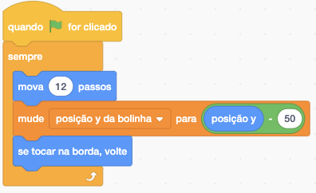
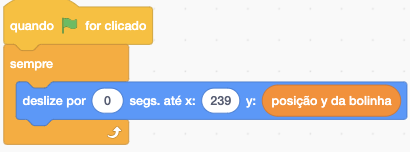

# Perguntas

## Aula 1

Link para o jogo pong no Scratch: <https://scratch.mit.edu/projects/410168240/>

1 - Para movimentar a raquete do oponente de forma inteligente, uma pessoa desenvolveu o seguinte código no ator bolinha:



E ator raquete oponente:



Após jogar algum tempo, percebeu que o jogo estava muito fácil, pois o oponente errava muito.

Com base no código usado pela pessoa, o que ela pode fazer para a raquete do oponente acertar mais a bolinha?

- No código de ator bolinha, a pessoa pode diminuir o valor do subtraendo.

> Certo! Quanto mais próximo de 0 for o subtraendo, mais perfeito será o movimento da raquete do oponente. Conforme diminuímos esse valor, aumentamos a chance de erro da raquete do oponente.

- No código de ator bolinha, a pessoa pode zerar o valor do subtraendo e passar a posição Y da bolinha.
- No código de ator bolinha, a pessoa pode alterar o valor do subtraendo para -100.

## Aula 2

1 - Sem alterar o comportamento do jogo, movemos alguns códigos da função draw para funções que criamos:

``` javascript
function mostraBolinha()
```

``` javascript
function movimentaBolinha()
```

``` javascript
function verificaColisaoBorda()
```

Sabendo disso, podemos definir que função é:

- Um conceito que está relacionado com a ideia de classificar e abstrair coisas.
- A união de vários códigos aleatórios, com comportamentos diferentes em um único lugar, visando tornar o código mais legível.
- __Um conjunto de comandos ou códigos que realiza uma tarefa específica.__

> Certo! No nosso caso, cada função criada é responsável por um comportamento, tornando a leitura do código mais intuitiva e simples.
